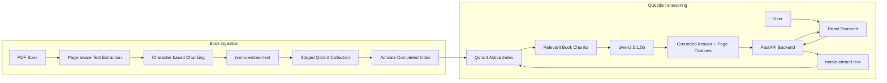

# Human Pose Estimation Book RAG

A private, local Retrieval-Augmented Generation (RAG) system for asking questions about a Human Pose Estimation reference book. The application retrieves relevant passages from the indexed PDF, asks a local language model to answer only from that context, and returns the answer with source excerpts and page citations.

Inference, embeddings, and vector storage run locally. No hosted model or cloud vector database is required after the container images and models have been downloaded.

## Project Overview

The project is designed around one primary Human Pose Estimation PDF. During ingestion, the backend extracts text page by page, divides it into overlapping character-based chunks, embeds those chunks, and stores them in Qdrant. At query time, the same embedding model converts the user's question to a vector, Qdrant finds the most relevant book chunks, and Qwen generates a grounded answer from the retrieved evidence.

The React interface exposes service and index status, indexing controls, grounded answers, retrieved excerpts, relevance scores, and source page numbers.

## Architecture

- **React** provides the browser interface for indexing, configuration controls, questions, answers, and citations.
- **FastAPI** validates requests and coordinates PDF ingestion, retrieval, prompt construction, and response serialization.
- **Ollama** serves both local models inside Docker.
- **`nomic-embed-text:latest`** creates vectors for book chunks and user queries.
- **Qdrant** stores chunk vectors and metadata and performs cosine-similarity retrieval.
- **`qwen2.5:1.5b`** generates an answer constrained by the retrieved passages.

The basic query flow is:

`User -> React -> FastAPI -> query embedding -> Qdrant -> relevant chunks -> Qwen -> grounded answer and page citations`

## Architecture Diagram



## Prerequisites

- Docker Desktop with Docker Compose v2. Docker Engine with the Compose plugin is also suitable on Linux.
- Git for cloning the repository.
- Internet access on the first start to download container images and the two Ollama models.
- An unencrypted, text-based PDF of the source book.
- Several gigabytes of free disk space for Docker images, Ollama models, and Qdrant data. Around 6-8 GB of available RAM is recommended for comfortable CPU-based local use; actual consumption depends on the host and workload.

Ollama runs as a service in `docker-compose.yml`; a host Ollama installation is not required for the standard Docker workflow. GPU acceleration is optional and is not configured by this repository. The stack works on Windows, macOS, or Linux where Docker Compose and Linux containers are supported. On Windows, Docker Desktop must be allowed to access any drive containing a PDF referenced by an absolute path.

## Models Used

| Model | Role |
| --- | --- |
| `qwen2.5:1.5b` | Generates answers from the retrieved context. |
| `nomic-embed-text:latest` | Embeds source chunks during indexing and questions during retrieval. |

These lightweight local models were selected because the current development environment has limited hardware capabilities and GPU acceleration is unavailable or insufficient for larger models. `qwen2.5:1.5b` is small enough for practical local generation, while `nomic-embed-text` is a lightweight fit for the local embedding pipeline.

This is primarily a hardware and development constraint, not a claim that these are the strongest models for production answer quality. Both can be replaced later when stronger GPU resources are available, although changing the embedding model or its vector dimension requires re-indexing.

## Setup

1. Clone the repository and enter it:

   ```bash
   git clone https://github.com/Mostafa-khaled11/Rag-system-of-Human-Pose-Estimation-Bible.git
   cd Rag-system-of-Human-Pose-Estimation-Bible
   ```

2. Create the local configuration file:

   PowerShell:

   ```powershell
   Copy-Item .env.example .env
   ```

   Bash:

   ```bash
   cp .env.example .env
   ```

3. Add the PDF as described in [Adding the Book](#adding-the-book). The default `.env.example` expects `data/source/HPE-Bible.pdf`.

4. Build and start the stack:

   ```bash
   docker compose up --build -d
   ```

5. Follow the one-time model download if needed:

   ```bash
   docker compose logs -f ollama-init
   ```

6. Open <http://localhost:3000>, wait for Ollama and Qdrant to report healthy, then select **Index book**.

Do not commit `.env`; it is intentionally ignored. The tracked `.env.example` contains all supported settings and safe local defaults.

## Required Ollama Models

The `ollama-init` service automatically downloads both required models during the first Docker startup and stores them in the persistent `ollama_data` volume. Later starts reuse the downloaded models.

No manual model pull is needed for the normal Docker setup. To refresh the models explicitly while the stack is running, use:

```bash
docker compose exec ollama ollama pull qwen2.5:1.5b
docker compose exec ollama ollama pull nomic-embed-text:latest
```

If developing against a separately installed host Ollama instance instead, the equivalent host commands are:

```bash
ollama pull qwen2.5:1.5b
ollama pull nomic-embed-text:latest
```

Host-based backend development also requires overriding `OLLAMA_BASE_URL` and `QDRANT_URL` with host-accessible addresses.

## Adding the Book

Place a legally obtained, unencrypted, text-based PDF at:

```text
data/source/HPE-Bible.pdf
```

The default `BOOK_HOST_PATH=./data/source/HPE-Bible.pdf` bind-mounts that file read-only inside the backend container at `/data/source/HPE-Bible.pdf`. You may instead set `BOOK_HOST_PATH` in `.env` to another host path accessible to Docker Desktop.

`data/source/*` is excluded by `.gitignore` except for its `.gitkeep` file. Source books are intentionally not versioned; do not add or commit copyrighted PDFs.

## Indexing and Re-indexing

Indexing does not run automatically. Start it with the **Index book** button or call the API:

```bash
curl -X POST http://localhost:8000/api/ingest \
  -H "Content-Type: application/json" \
  -d '{"force":false}'
```

The ingestion pipeline:

1. Validates the source as a readable, unencrypted PDF with sufficient extractable text.
2. Extracts and normalizes text page by page while retaining page numbers.
3. Splits each page into chunks, using 1,200 characters and 200 characters of overlap by default.
4. Embeds the chunks in batches with `nomic-embed-text:latest`.
5. Builds a temporary Qdrant collection and records document and configuration metadata.
6. Activates the completed collection only after every chunk and the manifest have been stored successfully.

Chunk size is the approximate maximum number of characters in each passage. Overlap repeats trailing context in the following chunk to reduce information loss at boundaries. The implementation prefers paragraph or sentence boundaries when possible and merges small final fragments where they fit.

Repeated ingestion with the same PDF and chunk configuration is idempotent unless `force` is true. Changing chunk size or overlap requires re-indexing because stored chunks and embeddings must be rebuilt. The UI sends a forced re-index for an existing index. The active Qdrant alias is changed only after the staged index succeeds, so a failed run does not replace the usable index.

To force the current configuration to be rebuilt through the API:

```bash
curl -X POST http://localhost:8000/api/ingest \
  -H "Content-Type: application/json" \
  -d '{"force":true}'
```

## Running the Application

Start or resume all services:

```bash
docker compose up -d
```

Check container status:

```bash
docker compose ps
```

Stop containers without deleting models or vectors:

```bash
docker compose down
```

| Service | URL |
| --- | --- |
| React frontend | <http://localhost:3000> |
| FastAPI OpenAPI documentation | <http://localhost:8000/docs> |
| Backend health endpoint | <http://localhost:8000/health> |

The API also exposes `GET /api/config`, `GET /api/documents`, `POST /api/ingest`, and `POST /api/query`.

## Example Query and Response

Example question:

> Why is monocular 3D human pose estimation considered ill-posed?

A representative shortened response has this form (the page is populated from the chunks actually retrieved from your indexed copy):

> A single 2D image does not uniquely determine a 3D pose: different depths and 3D body configurations can produce similar 2D projections. Recovering 3D pose therefore requires additional learned priors or constraints. `[p. <retrieved page>]`

The UI then lists the supporting source entry with its page, detected section, relevance score, and a short excerpt from the retrieved chunk. This example paraphrases the expected answer shape and does not reproduce book text or claim a fixed page number.

## Screenshots

No repository screenshot is currently available. Place a real application capture at `docs/images/application.png`, then replace this note with:

```markdown

```

The `docs/images/` directory is tracked with a placeholder so screenshots can be added later without fabricating UI output.

## Project Structure

```text
.
|-- .github/workflows/ci.yml   # Backend and frontend continuous integration
|-- backend/
|   |-- app/                   # FastAPI, ingestion, retrieval, and service clients
|   |-- tests/                 # Backend unit tests
|   `-- pyproject.toml         # Python dependencies and Ruff/Pytest configuration
|-- data/source/               # Ignored location for the local source PDF
|-- docs/images/               # Real UI screenshots when available
|-- frontend/
|   |-- src/                   # React application and Vitest tests
|   `-- package.json           # Frontend scripts and dependencies
|-- .env.example               # Public configuration template
|-- docker-compose.yml         # Ollama, Qdrant, backend, and frontend services
`-- Makefile                   # Common local commands
```

## Testing

The basic checks do not require Ollama, Qdrant, a GPU, or the source PDF. Backend tests use fakes or mocked HTTP responses for external services.

Run the same backend commands used by CI:

```bash
cd backend
python -m pip install -e ".[dev]"
python -m ruff check .
python -m pytest
```

Run the same frontend commands used by CI:

```bash
cd frontend
npm ci
npm run lint
npm test
npm run build
```

The production build runs `tsc -b` before Vite, so TypeScript static checking is part of the build. You can also validate the resolved Docker configuration from the repository root with:

```bash
docker compose --env-file .env.example config --quiet
```

## Limitations

- CPU inference can be relatively slow; generation latency depends heavily on host hardware.
- The lightweight 1.5B generation model may produce weaker answers than larger models.
- The system constrains generation to retrieved text, but retrieval and citation grounding still need broader evaluation.
- PDF extraction is text-based. Scanned or image-only pages require OCR, which is not implemented.
- Diagrams, equations, complex layouts, and multi-column reading order may not survive PDF text extraction accurately.
- Chunking is character-based rather than token-based, with heuristic boundary and heading detection.
- The current configuration is designed around one primary source book rather than a multi-document library.

## Future Improvements

- Adopt a stronger generation model when suitable GPU hardware is available.
- Add optional, documented GPU acceleration.
- Create a book-specific RAG evaluation dataset and automated quality checks.
- Add retrieval reranking and stronger citation-grounding validation.
- Stream generated responses to the frontend.
- Support multiple books and document management.

## Data and Reset Safety

The PDF is mounted read-only, and downloaded models and vectors live in named Docker volumes. `docker compose down` preserves them. The following command is intentionally destructive and removes both named volumes:

```bash
docker compose down -v
```

It does not remove the host PDF, but it deletes downloaded models and indexed vectors and should only be used for a full reset.
